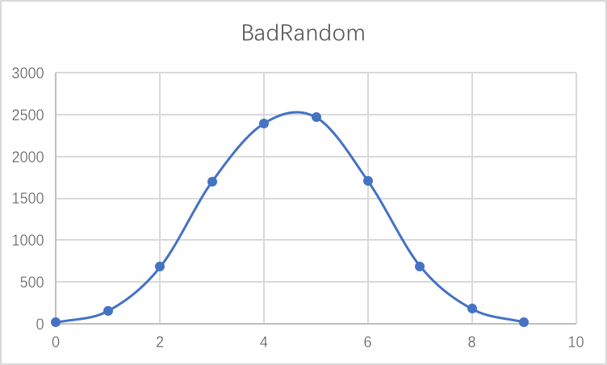

## 确定[a,b]均匀分布
### 错误方法. 每次递增[0,1]随机值
	int BadRandom(int a, int b) {
    	int r = a;
    	for (int i = 0; i < b - a; ++i) {
              r += Random();
    	}
    	return r;
	}
该方法错误的原因在于1 + 1 + 0 + 0 、0 + 1 + 1 + 0, ... , 0 + 0 + 1 + 1的值都是相同的，所以返回值分布为正态分布.实验结果分布图如下：

### 正确方法. 每次random位值
	int UniformRandom(int a, int b) {
    	int n = b - a + 1, bits = ceil(log2(n));
    	for (;;) {
              int r = 0;
              for (int i = 0; i < bits; ++i) {
            	    r += (Random() << i);
              }
              if (r <= n) {
                    return r + a;
              }
    	}
	}
	

